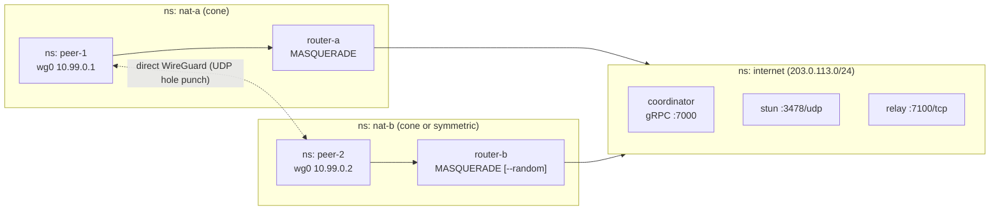
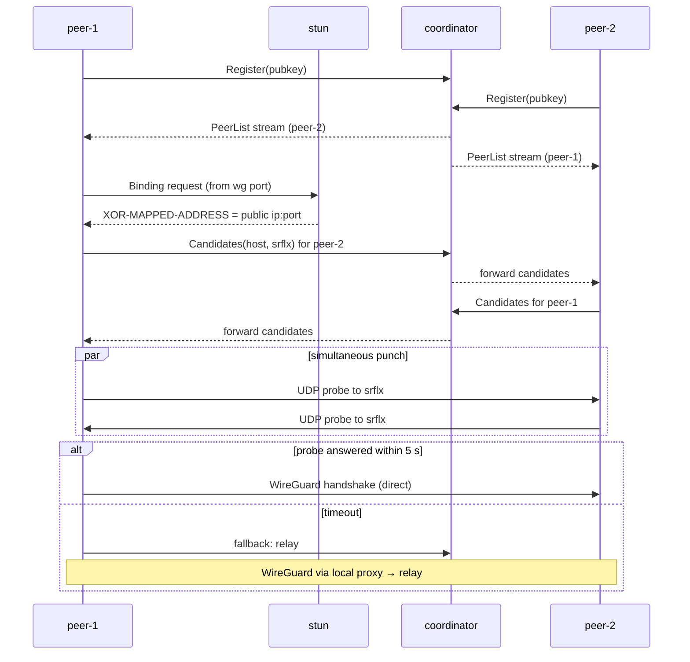

# minimesh — a tiny NetBird in Go (Showcase Plan)

Plan v1.0 — 2026-09-24 · Budget: 7 days, ~35 hours

## 1. Purpose

Build a small peer-to-peer WireGuard mesh in Go that recreates NetBird's core
idea: peers behind NATs find each other through a coordinator, punch through
the NAT, talk over a WireGuard tunnel, and fall back to a relay when direct
connection fails.

It closes the gaps for the NetBird Senior Backend Engineer role (Go
peer-to-peer networking core): **NAT traversal, WireGuard, peer-to-peer
connectivity**, plus the OAuth2/OIDC and control-plane angles. It must be
public on GitHub, run with one command, and every line must be explainable in
an interview.

Honest framing for the README: *a learning project that recreates NetBird's
architecture in miniature. Not production software.*

## 2. What it maps to in NetBird

| minimesh | NetBird | NetBird code |
| --- | --- | --- |
| `coordinator` (registry + peer-list stream) | Management service | `management/` |
| `coordinator` (candidate exchange) | Signal service | `signal/` |
| `relay` | Relay service | `relay/` |
| `peer` agent | Client agent | `client/internal/peer`, `client/iface` |
| Manual STUN + hole punching | ICE via `pion/ice` | `client/internal/peer/ice` |
| Local UDP proxy to relay | WireGuard proxy for relayed connections | `client/internal/` |
| OIDC login (stretch) | IdP integration (Dex, go-oidc) | `management/` |

## 3. Architecture



Connection lifecycle for one peer pair:



## 4. Environment (important: you're on macOS)

Network namespaces, iptables and kernel WireGuard are Linux-only. Run the lab
in a Linux VM:

- [ ] Install [Multipass](https://canonical.com/multipass) and start an Ubuntu 24.04 VM:

  ```sh
  brew install --cask multipass
  multipass launch 24.04 --name mesh --cpus 2 --memory 4G --disk 20G
  multipass shell mesh
  ```

- [ ] Inside the VM:

  ```sh
  sudo apt update
  sudo apt install -y wireguard-tools iproute2 iptables conntrack tcpdump iperf3 make docker.io docker-compose-v2
  sudo usermod -aG docker ubuntu   # log out and back in
  sudo snap install go --classic   # apt's golang-go can be too old for wireguard-go and pion
  ```

  Ubuntu's kernel has WireGuard built in; check with `sudo modprobe wireguard && lsmod | grep wireguard`.
- [ ] Get the code in. Either mount it (`multipass mount ~/code/minimesh mesh:/home/ubuntu/minimesh`,
  writable), or clone it inside the VM. The mount can make `go build` slow; if it
  does, clone inside or build on macOS with `GOOS=linux GOARCH=arm64 go build`
  and run the binaries through the mount.
- [ ] Lab scripts need root (`sudo make lab`), since they create namespaces and iptables rules.
- [ ] Useful: `multipass list` (VM IP), `multipass stop mesh` / `multipass start mesh`,
  `multipass delete --purge mesh` for a clean slate (Day 6 clean-clone test).

Fallback if Multipass fights you: one `--privileged` Docker container running the
same namespace scripts. Don't spend more than 1 hour on environment problems.

## 5. Repo layout

```text
minimesh/
├── cmd/
│   ├── coordinator/     # gRPC server: registry, peer-list stream, signalling
│   ├── peer/            # agent: STUN, punch, WireGuard config, relay fallback
│   ├── relay/           # TCP relay keyed by WireGuard public key
│   └── stun/            # tiny STUN server (pion/stun message codec)
├── internal/
│   ├── coord/           # registry, stream fan-out, candidate forwarding
│   ├── nat/             # STUN client, candidate gathering, hole punching
│   ├── wg/              # wgctrl wrapper: device, peers, endpoints, allowed IPs
│   ├── relay/           # relay protocol (framing, auth)
│   └── proxy/           # local UDP ⇄ relay proxy used by WireGuard
├── proto/minimesh.proto
├── lab/
│   ├── up.sh            # create namespaces, veths, NATs
│   ├── down.sh
│   └── nat-mode.sh      # switch nat-b between cone and symmetric
├── test/e2e.sh          # make demo + assertions
├── docs/
│   ├── ARCHITECTURE.md
│   └── MEASUREMENTS.md
├── Makefile             # make lab, make build, make demo, make demo-symmetric, make test
└── README.md
```

## 6. Milestones, tasks and learning resources

Each milestone lists what to read first, the tasks, and "done when". Times include
reading.

### M0 — Use NetBird itself (Day 1, ~5 h)

Understand the thing you're copying before you copy it.

#### Learn

- [How NetBird works](https://docs.netbird.io/about-netbird/how-netbird-works) — management, signal, relay, agent
- [NetBird vs traditional VPN](https://docs.netbird.io/about-netbird/netbird-vs-traditional-vpn)
- [How Tailscale works](https://tailscale.com/blog/how-tailscale-works) — the same model from a competitor, very clearly written
- [WireGuard whitepaper](https://www.wireguard.com/papers/wireguard.pdf) — sections 1–3 (cryptokey routing, endpoints, roaming)

#### Tasks

- [ ] Self-host NetBird with the [quickstart](https://docs.netbird.io/selfhosted/selfhosted-quickstart) (Docker Compose) in the Multipass VM or a cheap cloud VM.
- [ ] Connect two devices (laptop + VM). Run `netbird status -d` and note whether the connection is P2P or relayed.
- [ ] `wg show` on a peer: note the endpoint, latest handshake, allowed IPs.
- [ ] Keep a `NOTES.md` of anything confusing or broken in the docs. This is your lead for a NetBird docs contribution.
- [ ] Clone `netbirdio/netbird`; skim `signal/`, `relay/`, `client/internal/peer/`.

**Done when:** two devices ping each other over NetBird, and you can explain in two
sentences what management, signal and relay each do.

### M1 — The NAT lab (Day 2, ~5 h)

#### Learn

- [How NAT traversal works (Tailscale)](https://tailscale.com/blog/how-nat-traversal-works) — **the single most important read of the week**
- [RFC 4787](https://datatracker.ietf.org/doc/html/rfc4787) sections 4.1–4.3 — mapping vs filtering behaviour (endpoint-independent vs dependent)
- [Peer-to-Peer Communication Across NATs (Ford et al.)](https://bford.info/pub/net/p2pnat/) — the classic hole-punching paper
- [`ip netns` man page](https://man7.org/linux/man-pages/man8/ip-netns.8.html)

#### Tasks

- [ ] `lab/up.sh`: namespaces `internet`, `nat-a`, `nat-b`, `peer-1`, `peer-2`; veth pairs; addresses (`203.0.113.0/24` public, `192.168.1.0/24` and `192.168.2.0/24` private); default routes.
- [ ] NAT on `nat-a` and `nat-b`: `iptables -t nat -A POSTROUTING -o <wan> -j MASQUERADE` (behaves like an endpoint-independent mapping when the port is free).
- [ ] `lab/nat-mode.sh symmetric`: switch `nat-b` to `MASQUERADE --random-fully` — a new random port per destination, i.e. endpoint-dependent mapping (symmetric NAT).
- [ ] Prove it: from `peer-1`, send UDP to two servers in `internet`, and with `tcpdump` show the source port is the same in cone mode and different in symmetric mode.
- [ ] Prove `peer-1` cannot reach `peer-2`'s private address.
- [ ] `lab/down.sh` cleans up everything; `make lab` is idempotent.

**Done when:** you can show the mapping difference between cone and symmetric in
`tcpdump` output. Save the output for `docs/MEASUREMENTS.md`.

### M2 — Coordinator (Day 3 morning, ~3 h)

#### Learn

- Read NetBird's management `Sync` stream and signal service protos under `shared/` — how state is pushed to peers.
- gRPC server-streaming in Go (you know this already; skim only).

#### Tasks

- [ ] `proto/minimesh.proto`: `Register(pubkey, name) → overlay IP`, `Sync(pubkey) → stream PeerList`, `Signal(stream Envelope)` for candidate exchange.
- [ ] In-memory registry; assign overlay IPs from `10.99.0.0/24`.
- [ ] Push a fresh `PeerList` to every connected stream when a peer joins or leaves.
- [ ] Forward `Envelope{from, to, candidates}` between peers. Payload is opaque to the coordinator (NetBird encrypts it end-to-end; note this, optionally do it with NaCl box using the WireGuard keys).
- [ ] Unit tests: register, fan-out, disconnect cleanup.

**Done when:** two `peer` processes see each other in their peer lists.

### M3 — STUN and hole punching (Day 3 afternoon, ~3 h)

#### Learn

- [RFC 8489 (STUN)](https://datatracker.ietf.org/doc/html/rfc8489) sections 5–6 and XOR-MAPPED-ADDRESS (14.2)
- [pion/stun](https://github.com/pion/stun) README and examples
- [RFC 8445 (ICE)](https://datatracker.ietf.org/doc/html/rfc8445) sections 2 and 5.1 — candidate types (host, server-reflexive, relayed). Read for vocabulary, don't implement ICE.

#### Tasks

- [ ] `cmd/stun`: a tiny STUN server that answers Binding requests with XOR-MAPPED-ADDRESS (pion/stun for encoding). ~60 lines.
- [ ] Peer gathers candidates **from the same UDP port WireGuard will use** (e.g. 51820): host address + server-reflexive from STUN.
- [ ] Exchange candidates through the coordinator.
- [ ] Punch: both peers send small probe packets to each other's candidates every 200 ms for up to 5 s; stop on first reply. Log which candidate pair won.
- [ ] Close the probe socket, then hand the port to WireGuard. The NAT mapping (conntrack entry) survives because the source port is the same — verify with `conntrack -L` inside `nat-a`.

**Done when:** in cone mode a probe crosses both NATs; in symmetric mode it
times out. Both logged.

### M4 — WireGuard over the punched path (Day 4, ~5 h)

#### Learn

- [WireGuard quickstart](https://www.wireguard.com/quickstart/) — do it by hand once with `wg` and `ip`
- [wgctrl-go](https://github.com/WireGuard/wgctrl-go) — configuring devices from Go
- [wireguard-go](https://git.zx2c4.com/wireguard-go) and [`tun/netstack`](https://pkg.go.dev/golang.zx2c4.com/wireguard/tun/netstack) — the userspace option, to discuss even if you use the kernel module
- WireGuard whitepaper section 2.1 (cryptokey routing) again, now with context

#### Tasks

- [ ] Generate a keypair per peer on first start (`wgtypes.GeneratePrivateKey`), persist to a file.
- [ ] Create `wg0` in the peer namespace (kernel module via netlink), assign the overlay IP, listen on 51820.
- [ ] On a successful punch, set the remote peer's endpoint to the winning candidate; `AllowedIPs = <peer overlay IP>/32`; `PersistentKeepalive = 25` to keep the NAT mapping alive.
- [ ] React to `PeerList` changes: add/remove WireGuard peers.
- [ ] Hand-test: `ip netns exec peer-1 ping 10.99.0.2`, `wg show`, and `tcpdump` on the NAT showing only encrypted UDP.

**Done when:** `ping 10.99.0.2` works over the direct tunnel in cone mode.

### M5 — Relay fallback (Day 5, ~5 h)

#### Learn

- [RFC 8656 (TURN)](https://datatracker.ietf.org/doc/html/rfc8656) sections 1–3 — why relays exist and what they cost. Don't implement TURN.
- Read NetBird's `relay/` package: how peers authenticate and how frames are addressed.

#### Tasks

- [ ] `cmd/relay`: TCP server; a peer connects and authenticates with its WireGuard public key (signed challenge, or a token issued by the coordinator — keep it simple, document the choice); frames `{dst pubkey, payload}` are forwarded to the destination connection.
- [ ] `internal/proxy`: a local UDP socket on `127.0.0.1:<port>`. Set the WireGuard endpoint to it; the proxy wraps packets into relay frames and unwraps the reverse direction. This is how WireGuard stays unaware of the relay.
- [ ] Fallback logic: punch timeout → relay. Every 60 s, retry punching and upgrade to direct if it succeeds (log the switch).
- [ ] `--force-relay` flag for demos and tests.
- [ ] `make demo-symmetric`: nat-b symmetric → connection works via relay.

**Done when:** ping works in both modes, and the peer logs say `path=direct` or
`path=relay`.

### M6 — Tests, measurements, README (Day 6, ~5 h)

#### Tasks

- [ ] `test/e2e.sh`: `make lab && make demo`, assert ping succeeds and log contains `path=direct`; then symmetric mode, assert `path=relay`.
- [ ] `docs/MEASUREMENTS.md` — one table:

  | Metric | Direct | Relay |
  | --- | --- | --- |
  | Time from start to first ping reply | | |
  | RTT (`ping -c 100`, avg / p99) | | |
  | Throughput (`iperf3`, 10 s) | | |

  Add artificial latency with `tc qdisc add ... netem delay 20ms` on the internet
  link to make the relay cost visible.
- [ ] `README.md`: one-paragraph pitch, the two diagrams, `make demo` quick start (Multipass steps), what each milestone taught you, and **"How NetBird does it differently"**:
  - full ICE via `pion/ice` (candidate pairs, connectivity checks, priorities) instead of a manual punch;
  - end-to-end-encrypted signalling;
  - Rosenpass ([rosenpass.eu](https://rosenpass.eu)) for post-quantum pre-shared keys;
  - a management service that computes and pushes per-peer network maps from groups and policies, stored via GORM (SQLite, Postgres, MySQL);
  - userspace WireGuard and multiple OS backends.
- [ ] `docs/ARCHITECTURE.md`: components, the sequence diagram, trade-offs (why TCP relay, why close-and-reuse the port, what breaks).
- [ ] Clean clone test in a fresh VM.
- [ ] Optional: open the NetBird docs PR or Discussion from your M0 notes.

**Done when:** a stranger can run `make demo` from the README.

### M7 — Stretch (Day 7, only if M0–M6 are done)

Pick one:

- **OIDC login.** Keycloak in Docker; the peer CLI logs in with the
  [device authorization flow (RFC 8628)](https://datatracker.ietf.org/doc/html/rfc8628);
  the coordinator verifies the ID token with [go-oidc](https://github.com/coreos/go-oidc)
  and reads a `groups` claim. Policy: group `dev` can reach group `dev`; the
  coordinator only includes allowed peers in each `PeerList`. Links to your
  Keycloak and Teleport experience.
- **Network-map at scale** (the "database performance" angle). Store peers,
  groups and policies in Postgres; benchmark computing every peer's map for 1k,
  10k and 50k peers; then make updates incremental (only recompute affected
  peers). Put numbers in `MEASUREMENTS.md`. This is the best conversation starter
  for the management-service team.
- **Share one socket.** Write a custom wireguard-go `conn.Bind` that multiplexes
  STUN and WireGuard on one UDP socket, instead of close-and-reuse.

Always on Day 7: record a 60-second terminal demo (asciinema or GIF) and
rehearse a two-minute walkthrough out loud.

## 7. Schedule

| Day | Milestone | Hours | Must-have output |
| --- | --- | --- | --- |
| 1 | M0 NetBird hands-on | 5 | NetBird working; `NOTES.md` |
| 2 | M1 NAT lab | 5 | `make lab`; cone vs symmetric proven |
| 3 | M2 coordinator + M3 punching | 6 | probe crosses NATs |
| 4 | M4 WireGuard | 5 | ping over direct tunnel |
| 5 | M5 relay | 5 | ping in symmetric mode via relay |
| 6 | M6 tests, measurements, docs | 5 | public repo, README, e2e |
| 7 | M7 stretch + rehearsal | 4 | demo recording |

**Cut order if behind:** M7 → measurements → symmetric NAT (keep `--force-relay`)
→ E2E encryption of signalling. Never cut the README or `make demo`.

## 8. Risks

| Risk | Mitigation |
| --- | --- |
| Multipass / VM networking eats a day | 1-hour time box; fall back to a privileged Docker container |
| Port reuse after closing the probe socket fails | Set `SO_REUSEADDR`; confirm with `conntrack -L`; fallback: let WireGuard start first and send STUN from a raw socket, or do the M7 shared `conn.Bind` |
| Symmetric NAT sometimes punches anyway | Use `--random-fully`; confirm port changes in `tcpdump` |
| Scope creep into real ICE | Read ICE for vocabulary only; one candidate pair logic is enough |
| AI-generated code you can't explain | Write the NAT lab and punch logic by hand; review every agent diff line by line |

## 9. Interview talking points

- **What surprised me:** "Hole punching is mostly timing and keeping NAT mappings
  alive; the crypto is the easy part because WireGuard does it."
- **Why relays are unavoidable:** symmetric NAT gives a new port per destination,
  so the port learnt from STUN is wrong for the peer. Show the tcpdump.
- **The cost:** relay RTT and throughput numbers from `MEASUREMENTS.md`.
- **What I'd change for production:** full ICE, E2E-encrypted signalling,
  relay authentication and rate limits, reconnection and roaming, and
  incremental network-map computation.
- **Question to ask them:** "How do you compute and push network maps for large
  enterprise accounts — full recompute or incremental? What's the bottleneck,
  database or fan-out?"

## 10. Related

- Recruiter prep: [NetBird intro call prep](https://claude.ai/code/artifact/1498ebec-e4bd-4b4c-8258-a6da84c7cd93)
- Options doc: [NetBird one-week showcase options](https://claude.ai/code/artifact/86670fba-dc58-4e7a-a0e9-11d246b435db)
- Resume sent: `resume/AamirLatif-nb.pdf`

<!-- markdownlint-configure-file {"MD024": {"siblings_only": true}} -->
