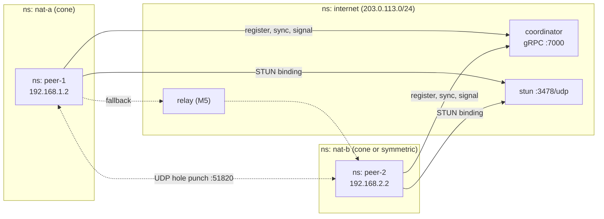

# minimesh

A tiny peer-to-peer mesh in Go that recreates [NetBird](https://netbird.io)'s
core idea in miniature: peers behind NATs find each other through a
coordinator, learn their public address via STUN, and punch a direct UDP path
through both NATs. WireGuard over that path and a relay fallback are next.

*A learning project, not production software.*

## Status

| Milestone | What | State |
| --- | --- | --- |
| M0 | Use NetBird itself; notes in [NOTES.md](NOTES.md) | in progress |
| M1 | NAT lab: namespaces, cone and symmetric NAT, proof via tcpdump | done |
| M2 | Coordinator: registry, peer-list stream, signalling | done |
| M3 | STUN server, candidate gathering, hole punching | done |
| M4 | WireGuard over the punched path | next |
| M5 | Relay fallback for symmetric NAT | planned |
| M6 | End-to-end test, measurements, docs | planned |

## Architecture



How one pair connects today:

1. Each peer loads or creates a WireGuard key; the public key is its identity.
2. `Register(pubkey)` with the coordinator returns an overlay IP from `10.99.0.0/24`.
3. From UDP port 51820 (the port WireGuard will use), the peer asks STUN for
   its public address: its server-reflexive (`srflx`) candidate. Local
   interface addresses are `host` candidates.
4. The peer opens `Signal` (a mailbox for messages from other peers), then
   `Sync` (a stream of the online peer list).
5. For each new peer in the list, it sends its candidates through the
   coordinator, which forwards them without reading them.
6. Both peers send small probes to each other's candidates every 200 ms for up
   to 5 s. The first answered probe wins and is logged as `path=direct`; a
   timeout is logged as `path=none` (the relay takes over in M5).

## How it maps to NetBird

| minimesh | NetBird |
| --- | --- |
| `coordinator` `Register` / `Sync` | Management service (`management/`) |
| `coordinator` `Signal` | Signal service (`signal/`) |
| `stun` | STUN server used by the agent's ICE |
| `peer` agent, manual punching | Client agent, ICE via `pion/ice` (`client/internal/peer`) |
| `relay` (M5) | Relay service (`relay/`) |

## Run it

Network namespaces and iptables are Linux-only. On macOS, use a Multipass VM:

```sh
make vm && make vm-shell          # on macOS: create VM "mesh", mount repo, install deps
cd ~/minimesh
```

NAT lab (M1):

```sh
sudo make lab                     # peer-1 behind nat-a, peer-2 behind nat-b (both cone)
sudo make prove                   # reachability checks + NAT mapping shown via tcpdump
sudo make nat-symmetric           # switch nat-b to symmetric NAT, then prove again
sudo make lab-down
```

Coordinator and hole punching (M2, M3):

```sh
make test                         # unit tests: coordinator, STUN, punching
sudo make demo                    # both NATs cone: peers punch a direct path
sudo make demo-symmetric          # nat-b symmetric: the punch times out
```

`make build` cross-compiles Linux binaries into `bin/`, so you can build on
macOS and run them in the VM through the mount. Demo logs land in
`lab/out/demo-<mode>/`. Run `make help` for every target.

## What the lab shows

Full output is in [docs/MEASUREMENTS.md](docs/MEASUREMENTS.md).

- **Cone vs symmetric.** Sending from port 51820 to two servers: behind a cone
  NAT both see `203.0.113.20:51820`; behind a symmetric NAT
  (`MASQUERADE --random-fully`) they see two different random ports. The
  port STUN reports is then useless to the other peer, so punching fails and
  a relay is unavoidable.
- **Punching.** Cone ↔ cone punched directly in 6/6 runs (~200 ms); cone ↔
  symmetric timed out in 4/4.
- **A Linux NAT stops being cone when ports collide.** Without a rule
  dropping unsolicited inbound traffic, the first probe from peer-1 reached
  nat-b before peer-2 had sent anything and got its own conntrack entry. That
  entry took port 51820, so when peer-2 sent, MASQUERADE quietly picked
  another port and the punch missed. The routers now drop unsolicited inbound
  traffic, like real home routers.

## Layout

```text
cmd/coordinator   gRPC server: registry, peer-list stream, signalling
cmd/peer          agent: key, register, STUN, candidate exchange, punching
cmd/stun          minimal STUN server (pion/stun)
internal/coord    registry and gRPC service
internal/nat      UDP endpoint, STUN client, candidates, hole punching
internal/wg       WireGuard key handling (device config comes in M4)
proto/            minimesh.proto and generated code (make proto)
lab/              namespace lab: up, down, nat-mode, prove, demo
docs/             measurements
```

## Known simplifications

- Signalling is plain text to the coordinator; NetBird encrypts it end to end.
- Peers aren't authenticated: anyone can claim any public key.
- Probes aren't signed; ICE authenticates connectivity checks.
- One candidate-pair race instead of full ICE (priorities, nomination).
- The coordinator is in memory only.
